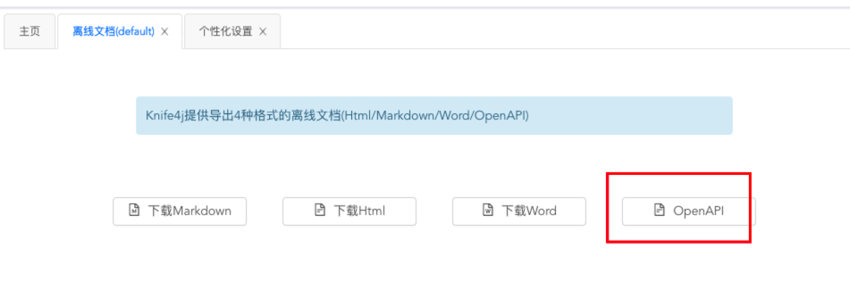

# swagger-ts-mcp

[中文](./README.md) | English

Auto-generate TypeScript type definitions from Swagger/OpenAPI docs for frontend API files.

Supports two modes: **CLI** and **MCP Server (AI IDE integration)**.

---

## Table of Contents

- [Install & Run Modes](#install--run-modes)
- [Quick Start](#quick-start)
- [Configuration](#configuration)
- [Config Resolution & Priority](#config-resolution--priority)
- [CLI Usage](#cli-usage)
- [MCP Server Usage](#mcp-server-usage)
- [API Tool Compatibility](#api-tool-compatibility)
- [How It Works](#how-it-works)
- [FAQ](#faq)

---

## Install & Run Modes

### Option1: Global install (for frequent usage)

```bash
npm install -g swagger-ts-mcp
```

Run:

```bash
swagger-ts-mcp --file src/api/user.ts --swagger https://your-api/doc.html
```

Note: `--file` is resolved relative to your current working directory. Run from project root or use an absolute path.

---

### Option2: Install in your project (recommended for teams)

> Version is pinned in your project, so everyone runs the same tool version.

npm:

```bash
npm i -D swagger-ts-mcp
npx --no-install swagger-ts-mcp --file src/api/user.ts --swagger https://your-api/doc.html
```

pnpm:

```bash
pnpm add -D swagger-ts-mcp
pnpm exec swagger-ts-mcp --file src/api/user.ts --swagger https://your-api/doc.html
```

yarn:

```bash
yarn add -D swagger-ts-mcp
yarn swagger-ts-mcp --file src/api/user.ts --swagger https://your-api/doc.html
```

---

### Option3: npx temporary run (no install)

```bash
npx swagger-ts-mcp --file src/api/user.ts --swagger https://your-api/doc.html
```

> If not installed locally, `npx` may fetch from npm.
> If you only want the local installed version, use `npx --no-install swagger-ts-mcp`.

---

## Quick Start

**Step1**: Create `swagger-ts-gen.config.json` in project root:

```json
{
  "swaggerUrl": "https://your-api/doc.html",
  "defaultFiles": ["src/api/user.ts"]
}
```

**Step2**: Run (choose one based on your install mode):

```bash
# A. Global install
swagger-ts-mcp

# B. Installed in project (npm)
npx --no-install swagger-ts-mcp

# C. Installed in project (pnpm)
pnpm exec swagger-ts-mcp
```

The tool will automatically:

1. Parse API files and find functions with `any` or untyped parameters
2. Fetch matching schemas from Swagger docs
3. Generate TypeScript interfaces/types above function definitions
4. Replace `any` with generated type names

**Example**:

Before:

```typescript
// Cancel publish
export async function cancelPublishApi(params?: any) {
  return requestClient.get("/model/publish/cancel", { params });
}
```

After:

```typescript
/** Cancel publish request params */
export interface CancelPublishParams {
  /** Model ID */
  modelId?: number;
}

// Cancel publish
export async function cancelPublishApi(params?: CancelPublishParams) {
  return requestClient.get("/model/publish/cancel", { params });
}
```

---

## Configuration

Create `swagger-ts-gen.config.json` in your project root:

```json
{
  "swaggerUrl": "https://your-api/doc.html",
  "defaultFiles": ["src/api/user.ts", "src/api/order.ts"],
  "endpointPrefix": "/algo",
  "clientName": "requestClient",
  "outputStyle": "interface"
}
```

| Option           | Type                    | Default           | Description                                                                               |
| ---------------- | ----------------------- | ----------------- | ----------------------------------------------------------------------------------------- |
| `swaggerUrl`     | `string`                | —                 | Swagger doc URL. Supports `doc.html`, `/v3/api-docs`, `/v2/api-docs`                      |
| `defaultFiles`   | `string[]`              | —                 | Default API file path list                                                                |
| `endpointPrefix` | `string`                | `""`              | API path prefix. If code uses `/algo/user/list` but Swagger has `/user/list`, set `/algo` |
| `clientName`     | `string`                | `"requestClient"` | HTTP client object name, e.g. `axios`, `http`, `request`                                  |
| `outputStyle`    | `"interface" \| "type"` | `"interface"`     | Generated type style                                                                      |

---

## Config Resolution & Priority

- Reads config from: `{current working directory}/swagger-ts-gen.config.json`
- That means it loads config from the directory where you run the command
- `--file` relative path is also resolved from current working directory
- CLI flags override config values:
- `--swagger`
- `--endpoint-prefix`
- `--client-name`

Example:

```bash
npx --no-install swagger-ts-mcp \
 --file src/api/algo/scheme.ts \
 --swagger https://optimos.dev.d2d.ai/api/algo/doc.html \
 --endpoint-prefix /algo
```

---

## CLI Usage

> Note: #1 ~ #3 are for global install. If installed in-project, use #4 / #5.

```bash
#1) Use config file (recommended, requires global install)
swagger-ts-mcp

#2) Specify file and swagger URL (requires global install)
swagger-ts-mcp --file src/api/user.ts --swagger https://your-api/doc.html

#3) Dry run (no file changes, requires global install)
swagger-ts-mcp --file src/api/user.ts --swagger https://your-api/doc.html --dry-run

#4) Project-local install (npm)
npx --no-install swagger-ts-mcp --file src/api/user.ts --swagger https://your-api/doc.html

#5) Project-local install (pnpm)
pnpm exec swagger-ts-mcp --file src/api/user.ts --swagger https://your-api/doc.html
```

### All Flags

| Flag                | Required?     | Default behavior when omitted                                    | Description                                                     | Example                                      |
| ------------------- | ------------- | ---------------------------------------------------------------- | --------------------------------------------------------------- | -------------------------------------------- |
| `--file`            | Conditionally | Uses `defaultFiles` from config; exits with error if still empty | Target API file path                                            | `--file src/api/user.ts`                     |
| `--swagger`         | Conditionally | Uses `swaggerUrl` from config; exits with error if still empty   | Swagger doc URL or local JSON file path                         | `--swagger https://api.example.com/doc.html` |
| `--functions`       | Optional      | Processes all eligible functions in target file                  | Process only specific functions (comma-separated or repeatable) | `--functions getUserApi,createUserApi`       |
| `--dry-run`         | Optional      | `false`                                                          | Preview mode, no file changes                                   | `--dry-run`                                  |
| `--json`            | Optional      | `false`                                                          | Print structured JSON on success                                | `--json`                                     |
| `--silent`          | Optional      | `false`                                                          | Suppress success logs (still prints errors)                     | `--silent`                                   |
| `--mcp`             | Optional      | `false`                                                          | Start as MCP Server                                             | `--mcp`                                      |
| `--endpoint-prefix` | Optional      | Uses config `endpointPrefix`; falls back to empty string         | API path prefix override                                        | `--endpoint-prefix /algo`                    |
| `--client-name`     | Optional      | Uses config `clientName`; falls back to `requestClient`          | HTTP client name override                                       | `--client-name axios`                        |

---

## MCP Server Usage

MCP (Model Context Protocol) mode allows AI IDEs to call this tool directly to generate types.

### Configure MCP Server — Kiro

Add to your project's `.kiro/settings/mcp.json`:

```json
{
  "mcpServers": {
    "swagger-ts-mcp": {
      "command": "npx",
      "args": ["swagger-ts-mcp", "--mcp"],
      "disabled": false,
      "autoApprove": ["generate_types"]
    }
  }
}
```

### Configure MCP Server — Cursor

Add in `.cursor/mcp.json` or your IDE MCP config:

```json
{
  "mcpServers": {
    "swagger-ts-mcp": {
      "command": "npx",
      "args": ["swagger-ts-mcp", "--mcp"]
    }
  }
}
```

After configuration, in Cursor press `Cmd+Shift+P`, search `MCP`, and click **Reload MCP Servers**.

> Depending on version/config, if MCP config file cannot be read, create the file as prompted and paste the JSON above.

### Use in AI IDE

**Kiro**: say in chat:

> Help me generate TypeScript types for `cancelPublishApi` (call `generate_types` tool)


**Cursor**: in Composer (`Cmd+I`) or Chat:

> Use the swagger-ts-mcp tool to generate TypeScript types for `cancelPublishApi`, file path: `src/api/user.ts`

### MCP Tool Parameters

Tool name: `generate_types`

| Parameter       | Type       | Required | Description                        |
| --------------- | ---------- | -------- | ---------------------------------- |
| `filePath`      | `string`   | ✅       | Target API file path               |
| `swaggerUrl`    | `string`   | —        | Swagger doc URL (overrides config) |
| `functionNames` | `string[]` | —        | Process only specified functions   |
| `dryRun`        | `boolean`  | —        | Preview mode, no file changes      |

---

## API Tool Compatibility

### Swagger / SpringDoc (default supported)

Pass `doc.html` directly. The tool auto-converts to `/v3/api-docs` or `/v2/api-docs`:

```bash
swagger-ts-mcp --file src/api/user.ts --swagger https://your-api/doc.html
```

### Local Swagger/OpenAPI JSON format requirements

When passing a local file to `--swagger` (for example `./openapi.json`), the file should satisfy:

- Valid JSON (UTF-8 recommended, usually `.json` extension)
- Top-level object must be a Swagger/OpenAPI document
- Must include `paths` (object)
- Keep `openapi` (OpenAPI 3) or `swagger` (Swagger 2) when available
- Referenced models should be in `components.schemas` (OpenAPI 3) or `definitions` (Swagger 2)

Minimal example:

```json
{
  "openapi": "3.0.0",
  "paths": {
    "/user/get": {
      "get": {
        "responses": {
          "200": {
            "description": "OK"
          }
        }
      }
    }
  }
}
```

For offline docs exported from Swagger/OpenAPI tools (same idea for other tools), place the exported JSON file in your project (or any local path), then pass that file path to `--swagger`.
Example: `/Users/code/Desktop/work/2025/apps/algo/default_OpenAPI.json`



### Knife4j

Fully compatible with Swagger. Use directly.

### YApi

Use YApi export URL:

```text
https://your-yapi.com/api/plugin/export?type=swagger&pid=<project_id>&token=<project_token>
```

```bash
swagger-ts-mcp --file src/api/user.ts --swagger "https://your-yapi.com/api/plugin/export?type=swagger&pid=123&token=abc123"
```

### Apifox

Export an OpenAPI3.0 online URL in Apifox and use it directly.

---

## How It Works

```text
API file (*.ts)
 ↓ Parse AST, find requestClient.xxx() calls
 ↓ Filter functions with any/untyped params
 ↓
Swagger doc
 ↓ Match endpoint + method
 ↓ Extract request schema and response schema
 ↓
TypeScript type generation
 ↓ Schema → interface/type definitions
 ↓ Handle recursive $ref, oneOf/anyOf/allOf
 ↓
Write back to file
 ↓ Insert type definitions above function
 ↓ Replace any with generated type names
```

### Naming Rules

| Type                | Rule               | Example             |
| ------------------- | ------------------ | ------------------- |
| Request params type | `{BaseName}Params` | `GetUserListParams` |
| Response body type  | `{BaseName}Result` | `GetUserListResult` |
| Response data type  | `{BaseName}Data`   | `GetUserListData`   |

Function name conversion: `getUserListApi` → remove `Api` suffix → capitalize first letter → `GetUserList`

---

## FAQ

**Q: Why does `npx swagger-ts-mcp` try to download from npm?**

A: Because package is not installed locally in current project. `npx` may fetch from npm by default.
If you only want local installed version:

```bash
npx --no-install swagger-ts-mcp
```

**Q: I installed it in my project. What should I use?**

A:

- npm project: `npx --no-install swagger-ts-mcp ...`
- pnpm project: `pnpm exec swagger-ts-mcp ...`
- yarn project: `yarn swagger-ts-mcp ...`

**Q: If installed locally, does it still read `swagger-ts-gen.config.json`?**

A: Yes. Whether global install, local install, or npx run, it always reads config from the current working directory.

**Q: I got ENOENT for `--file`. Why?**

A: Check whether `--file` is relative to your current directory.
If you run at project root, usually use `src/...` instead of repeating project prefix.

**Q: Code path has a prefix, but Swagger path doesn't.**

A: Use `--endpoint-prefix` or set `endpointPrefix` in config.

**Q: My project uses axios instead of requestClient. What should I do?**

```json
{ "clientName": "axios" }
```

**Q: I want to preview generated results without modifying files.**

Add `--dry-run`.

**Q: I only want to process specific functions.**

In CLI mode, use `--functions` (supports comma-separated values or repeating the flag).
Example: `--functions getUserApi,createUserApi` or `--functions getUserApi --functions createUserApi`.

In MCP mode, pass `functionNames`.

**Q: What if Swagger docs require login/authentication?**

Auth headers are not supported currently. You can open `/v3/api-docs` in browser, save the JSON locally, then use that.
CLI example: `swagger-ts-mcp --file src/api/user.ts --swagger ./openapi.json`.

**Q: `npx tsx packages/swagger-ts-gen/bin/index.ts` errors out?**

After downloading the package:

```bash
npx tsx packages/swagger-ts-gen/bin/index.ts \
 --file <path> \
 --swagger <swagger-url>
```

If you see `sh: tsx: command not found`, `tsx` is not installed globally.
Use local `node_modules` from `packages/swagger-ts-gen`:

```bash
npx --prefix packages/swagger-ts-gen tsx packages/swagger-ts-gen/bin/index.ts \
 --file <path> \
 --swagger <swagger-url>
```

Or call local binary directly:

```bash
packages/swagger-ts-gen/node_modules/.bin/tsx packages/swagger-ts-gen/bin/index.ts \
 --file <path> \
 --swagger <swagger-url>
```

Or install `tsx` globally:

```bash
npm install -g tsx
```

Then your original command will work.
