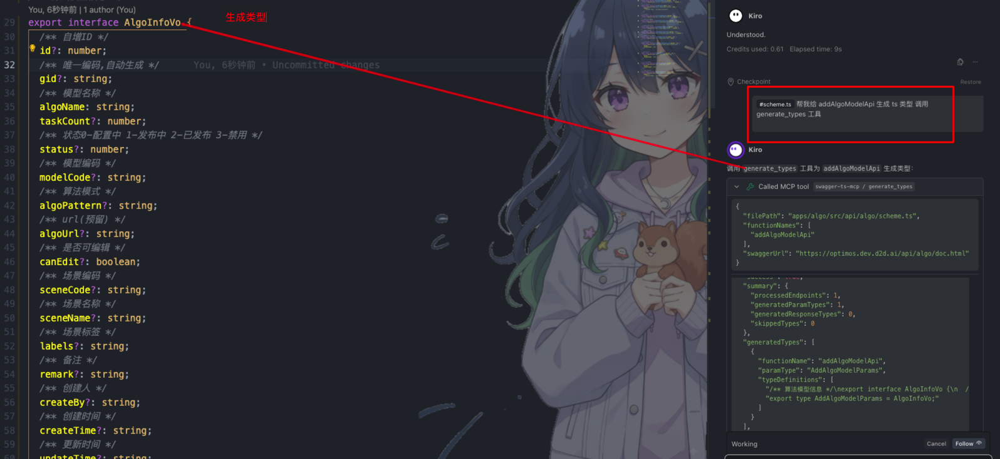
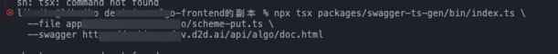

# swagger-ts-mcp

中文 | [English](./README.en.md)

从 Swagger/OpenAPI 文档自动为前端接口文件生成 TypeScript 类型定义。

支持两种调用方式：**命令行（CLI）** 和 **MCP Server（AI IDE 集成）**。

---

## 目录

- [安装与执行方式](#安装与执行方式)
- [快速开始](#快速开始)
- [配置文件](#配置文件)
- [配置读取规则与优先级](#配置读取规则与优先级)
- [命令行使用](#命令行使用)
- [MCP Server 使用](#mcp-server-使用)
- [针对不同 API 工具的使用方式](#针对不同-api-工具的使用方式)
- [工作原理](#工作原理)
- [常见问题](#常见问题)

---

## 安装与执行方式

### 方式一：全局安装（适合经常使用）

```bash
npm install -g swagger-ts-mcp
```

执行：

```bash
swagger-ts-mcp --file src/api/user.ts --swagger https://your-api/doc.html
```

注意：`--file` 路径是相对于当前命令行所在目录的，需要在项目根目录下执行，或使用绝对路径。

---

### 方式二：安装到项目依赖（推荐团队协作）

> 安装后会固定版本，团队成员执行行为一致。

npm:

```bash
npm i -D swagger-ts-mcp
npx --no-install swagger-ts-mcp --file src/api/user.ts --swagger https://your-api/doc.html
```

pnpm:

```bash
pnpm add -D swagger-ts-mcp
pnpm exec swagger-ts-mcp --file src/api/user.ts --swagger https://your-api/doc.html
```

yarn:

```bash
yarn add -D swagger-ts-mcp
yarn swagger-ts-mcp --file src/api/user.ts --swagger https://your-api/doc.html
```

---

### 方式三：npx 临时使用（不安装）

```bash
npx swagger-ts-mcp --file src/api/user.ts --swagger https://your-api/doc.html
```

> `npx` 在本地没安装时会尝试从 npm 拉取。
> 如果你只想用“本地已安装版本”，请使用 `npx --no-install swagger-ts-mcp`。

---

## 快速开始

**第一步**：在项目根目录创建配置文件 `swagger-ts-gen.config.json`：

```json
{
  "swaggerUrl": "https://your-api/doc.html",
  "defaultFiles": ["src/api/user.ts"]
}
```

**第二步**：运行命令（按你的安装方式选择其一）：

```bash
# A. 全局安装后可直接用
swagger-ts-mcp

# B. 安装到项目依赖（npm）
npx --no-install swagger-ts-mcp

# C. 安装到项目依赖（pnpm）
pnpm exec swagger-ts-mcp
```

工具会自动：

1. 解析接口文件，找出参数类型为 `any` 或未定义的函数
2. 从 Swagger 文档获取对应接口的 Schema
3. 生成 TypeScript interface/type，插入到函数定义上方
4. 将函数参数的 `any` 替换为生成的具体类型名

**示例**：

处理前：

```typescript
// 取消发布
export async function cancelPublishApi(params?: any) {
  return requestClient.get("/model/publish/cancel", { params });
}
```

处理后：

```typescript
/** 取消发布请求参数 */
export interface CancelPublishParams {
  /** 模型ID */
  modelId?: number;
}

// 取消发布
export async function cancelPublishApi(params?: CancelPublishParams) {
  return requestClient.get("/model/publish/cancel", { params });
}
```

---

## 配置文件

在项目根目录创建 `swagger-ts-gen.config.json`：

```json
{
  "swaggerUrl": "https://your-api/doc.html",
  "defaultFiles": ["src/api/user.ts", "src/api/order.ts"],
  "endpointPrefix": "/algo",
  "clientName": "requestClient",
  "outputStyle": "interface"
}
```

| 配置项           | 类型                    | 默认值            | 说明                                                                                       |
| ---------------- | ----------------------- | ----------------- | ------------------------------------------------------------------------------------------ |
| `swaggerUrl`     | `string`                | —                 | Swagger 文档地址，支持 `doc.html`、`/v3/api-docs`、`/v2/api-docs`                          |
| `defaultFiles`   | `string[]`              | —                 | 默认处理的接口文件路径列表                                                                 |
| `endpointPrefix` | `string`                | `""`              | 接口路径前缀。代码里路径是 `/algo/user/list`，但 Swagger 里是 `/user/list`，则设为 `/algo` |
| `clientName`     | `string`                | `"requestClient"` | HTTP 客户端对象名称，如 `axios`、`http`、`request`                                         |
| `outputStyle`    | `"interface" \| "type"` | `"interface"`     | 生成类型的风格                                                                             |

---

## 配置读取规则与优先级

- 工具读取：`{当前工作目录}/swagger-ts-gen.config.json`
- 也就是：你从哪个目录执行命令，就从哪个目录找配置文件
- `--file` 相对路径也是相对于当前工作目录
- CLI 参数优先级高于配置文件（会覆盖配置）：
  - `--swagger`
  - `--endpoint-prefix`
  - `--client-name`

示例：

```bash
npx --no-install swagger-ts-mcp \
  --file src/api/algo/scheme.ts \
  --swagger https://optimos.dev.d2d.ai/api/algo/doc.html \
  --endpoint-prefix /algo
```

---

## 命令行使用

> 说明：#1 ~ #3 适用于“全局安装”；如果是“安装到项目依赖”，请使用 #4 / #5。

```bash
# 1) 使用配置文件（推荐，需全局安装）
swagger-ts-mcp

# 2) 指定文件和文档地址（需全局安装）
swagger-ts-mcp --file src/api/user.ts --swagger https://your-api/doc.html

# 3) 预览模式，不修改文件（需全局安装）
swagger-ts-mcp --file src/api/user.ts --swagger https://your-api/doc.html --dry-run

# 4) 项目本地安装后执行（npm）
npx --no-install swagger-ts-mcp --file src/api/user.ts --swagger https://your-api/doc.html

# 5) 项目本地安装后执行（pnpm）
pnpm exec swagger-ts-mcp --file src/api/user.ts --swagger https://your-api/doc.html
```

### 所有参数

| 参数                | 说明                            | 示例                                         |
| ------------------- | ------------------------------- | -------------------------------------------- |
| `--file`            | 目标接口文件路径                | `--file src/api/user.ts`                     |
| `--swagger`         | Swagger 文档地址                | `--swagger https://api.example.com/doc.html` |
| `--dry-run`         | 预览模式，不修改文件            | `--dry-run`                                  |
| `--mcp`             | 以 MCP Server 模式启动          | `--mcp`                                      |
| `--endpoint-prefix` | 接口路径前缀（覆盖配置文件）    | `--endpoint-prefix /algo`                    |
| `--client-name`     | HTTP 客户端名称（覆盖配置文件） | `--client-name axios`                        |

---

## MCP Server 使用

MCP（Model Context Protocol）模式允许 AI IDE 直接调用本工具生成类型，无需手动运行命令。

### 配置 MCP Server — Kiro

在项目的 `.kiro/settings/mcp.json` 中添加：

```json
{
  "mcpServers": {
    "swagger-ts-mcp": {
      "command": "npx",
      "args": ["swagger-ts-mcp", "--mcp"],
      "disabled": false,
      "autoApprove": ["generate_types"]
    }
  }
}
```

### 配置 MCP Server — Cursor

在 `.cursor/mcp.json` 或对应 IDE 配置中添加：

```json
{
  "mcpServers": {
    "swagger-ts-mcp": {
      "command": "npx",
      "args": ["swagger-ts-mcp", "--mcp"]
    }
  }
}
```

配置完成后，在 Cursor 中按 `Cmd+Shift+P` 搜索 `MCP`，点击 **Reload MCP Servers** 使配置生效。

> 因为版本或配置不同，如果提示 MCP 文件无法读取，按照提示创建文件并输入上面的 JSON 即可。

### 在 AI IDE 中使用

**Kiro**：直接在聊天框中说：

> 帮我给 `cancelPublishApi` 生成 TypeScript 类型（调用 generate_types 工具）



**Cursor**：在 Composer（`Cmd+I`）或 Chat 中说：

> 使用 swagger-ts-mcp 工具，帮我给 `cancelPublishApi` 生成 TypeScript 类型，文件路径是 src/api/user.ts

### MCP 工具参数

工具名：`generate_types`

| 参数            | 类型       | 必填 | 说明                                          |
| --------------- | ---------- | ---- | --------------------------------------------- |
| `filePath`      | `string`   | ✅   | 目标接口文件路径                              |
| `swaggerUrl`    | `string`   | —    | Swagger 文档地址（优先于配置文件）            |
| `functionNames` | `string[]` | —    | 只处理指定函数，不传则处理所有 `any` 类型函数 |
| `dryRun`        | `boolean`  | —    | 预览模式，不修改文件                          |

---

## 针对不同 API 工具的使用方式

### Swagger / SpringDoc（默认支持）

直接传 `doc.html` 地址，工具自动转换为 `/v3/api-docs` 或 `/v2/api-docs`：

```bash
swagger-ts-mcp --file src/api/user.ts --swagger https://your-api/doc.html
```

### Knife4j

Knife4j 是 Swagger 的增强版，完全兼容，直接使用。

### YApi

使用 YApi 导出接口：

```text
https://your-yapi.com/api/plugin/export?type=swagger&pid=<项目ID>&token=<项目token>
```

```bash
swagger-ts-mcp --file src/api/user.ts --swagger "https://your-yapi.com/api/plugin/export?type=swagger&pid=123&token=abc123"
```

### Apifox

在 Apifox 中导出 OpenAPI 3.0 在线 URL 后直接使用。

---

## 工作原理

```text
接口文件 (*.ts)
    ↓ 解析 AST，找出 requestClient.xxx() 调用
    ↓ 过滤参数类型为 any 或未定义的函数
    ↓
Swagger 文档
    ↓ 根据 endpoint + method 查找接口定义
    ↓ 提取 request schema 和 response schema
    ↓
TypeScript 类型生成
    ↓ Schema → interface/type 定义
    ↓ 处理 $ref 递归引用、oneOf/anyOf/allOf
    ↓
写入文件
    ↓ 插入类型定义到函数上方
    ↓ 将 any 替换为具体类型名
```

### 命名规范

| 类型               | 命名规则           | 示例                |
| ------------------ | ------------------ | ------------------- |
| 请求参数类型       | `{BaseName}Params` | `GetUserListParams` |
| 响应体类型         | `{BaseName}Result` | `GetUserListResult` |
| 响应 data 字段类型 | `{BaseName}Data`   | `GetUserListData`   |

函数名转换规则：`getUserListApi` → 去掉 `Api` 后缀 → 首字母大写 → `GetUserList`

---

## 常见问题

**Q：`npx swagger-ts-mcp` 为什么会提示去远程下载？**

A：因为当前项目没有本地安装该包。`npx` 默认会尝试从 npm 拉取。
如果你只希望使用本地版本，请用：

```bash
npx --no-install swagger-ts-mcp
```

**Q：我已经安装到项目里了，推荐怎么执行？**

A：

- npm 项目：`npx --no-install swagger-ts-mcp ...`
- pnpm 项目：`pnpm exec swagger-ts-mcp ...`
- yarn 项目：`yarn swagger-ts-mcp ...`

**Q：下载到项目里后，还会读取 `swagger-ts-gen.config.json` 吗？**

A：会。无论全局安装、本地安装还是 npx 执行，都会读取“当前工作目录”下的配置文件。

**Q：路径报 ENOENT 怎么办？**

A：检查 `--file` 路径是否相对“当前执行目录”。
例如你在项目根目录执行，通常应写 `src/...`，而不是重复加项目前缀路径。

**Q：接口路径在代码里有前缀，但 Swagger 里没有，怎么处理？**

A：使用 `--endpoint-prefix` 或配置 `endpointPrefix`。
**Q：项目用的是 axios 而不是 requestClient，怎么办？**

```json
{ "clientName": "axios" }
```

**Q：想先预览生成结果，不修改文件怎么做？**

加上 `--dry-run` 参数。

**Q：只想处理某几个函数？**

MCP 模式下传 `functionNames` 参数。
**Q：Swagger 文档需要登录认证怎么办？**

目前不支持带认证头的请求。可以在浏览器中打开 `/v3/api-docs`，将 JSON 内容保存为本地文件后使用。
**Q：npx tsx packages/swagger-ts-gen/bin/index.ts 报错？**

包下载以后

```bash
npx tsx packages/swagger-ts-gen/bin/index.ts \
  --file 路径 \
  --swagger swagger地址
```

执行命令如图



报错 sh: tsx: command not found

`tsx` 没有全局安装，`npx tsx` 找不到。改成从 `packages/swagger-ts-gen` 的本地 `node_modules` 里调用：

```bash
npx --prefix packages/swagger-ts-gen tsx packages/swagger-ts-gen/bin/index.ts \
  --file 路径 \
  --swagger 地址
```

或者直接用 `node_modules/.bin/tsx`：

```bash
packages/swagger-ts-gen/node_modules/.bin/tsx packages/swagger-ts-gen/bin/index.ts \
  --file 路径 \
  --swagger 地址
```

或者全局装一下 `tsx`，以后就不用每次这样了：

```bash
npm install -g tsx
```

装完之后原来的命令就能用了。
